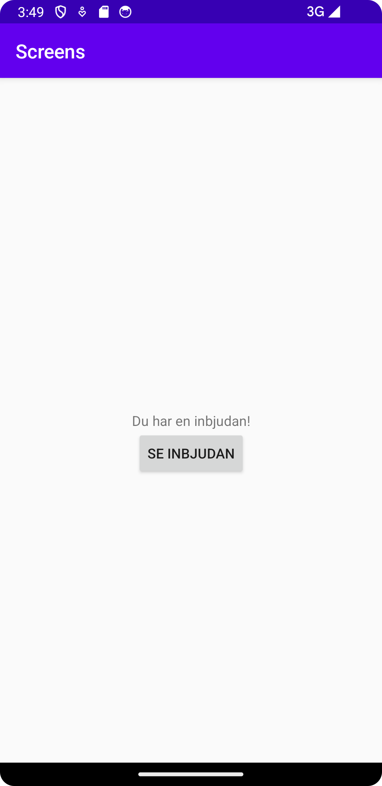
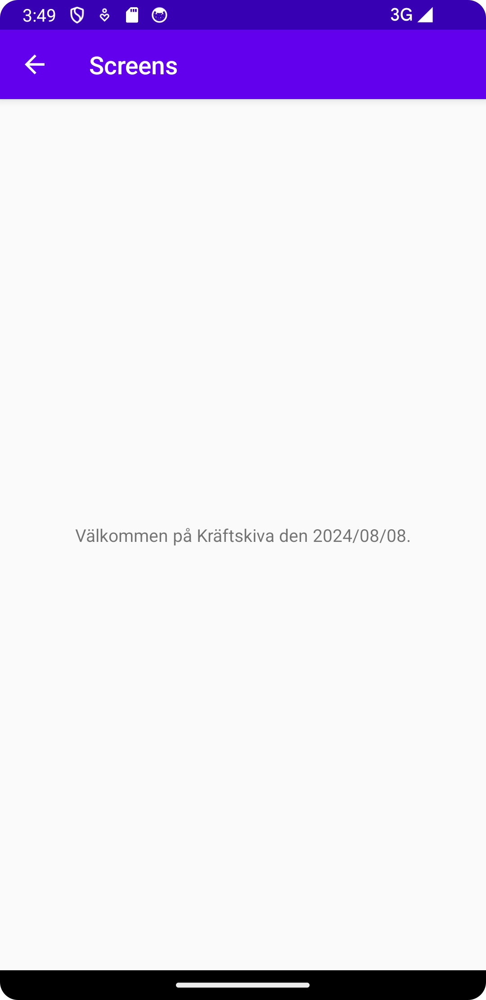

# Rapport

Följande är gjort i denna uppgift, programkod följer efter.

1. Lade till en ny activity "SecondaryActivity".
2. Skapade en button i layout filen, och kopplade med en ny java funktion "onClick".
3. Lade till date till intent bundle med extras.
4. Lade till en textview i activity_secondary.xml
```
1. 
Skapade filen i src/main/java/com.examples.screens.

2. 
// I activity_main.xml
<Button
        android:id="@+id/magicButton"
        android:layout_width="wrap_content"
        android:layout_height="wrap_content"
        android:text="Se inbjudan"
        app:layout_constraintLeft_toLeftOf="parent"
        app:layout_constraintRight_toRightOf="parent"
        app:layout_constraintTop_toBottomOf="@id/TextView"/>

// I MainActivity.java

Button toSecondaryActivity = findViewById(R.id.magicButton);

toSecondaryActivity.setOnClickListener(new View.OnClickListener() {
            @Override
            public void onClick(View v) {
                Intent intent = new Intent(MainActivity.this, SecondaryActivity.class);
                startActivity(intent);
            }
        });

3.
String celebration;
String date;

public void onClick(View v) {
                Intent intent = new Intent(MainActivity.this, SecondaryActivity.class);
                intent.putExtra("celebration", högtid);
                intent.putExtra("date", datum);
                startActivity(intent);
            }

4. 
// I activity_secondary.xml

<TextView
        android:layout_width="wrap_content"
        android:layout_height="wrap_content"
        android:text=""
        android:id="@+id/TextView"
        app:layout_constraintBottom_toBottomOf="parent"
        app:layout_constraintLeft_toLeftOf="parent"
        app:layout_constraintRight_toRightOf="parent"
        app:layout_constraintTop_toTopOf="parent" />
        
// I SecondaryActivity.java 

Bundle extras = getIntent().getExtras();
celebration = extras.getString("celebration");
date = extras.getString("date");
        
TextView textView = findViewById(R.id.TextView);

textView.setText("Välkommen på " + celebration + " den " + date + ".");

```





